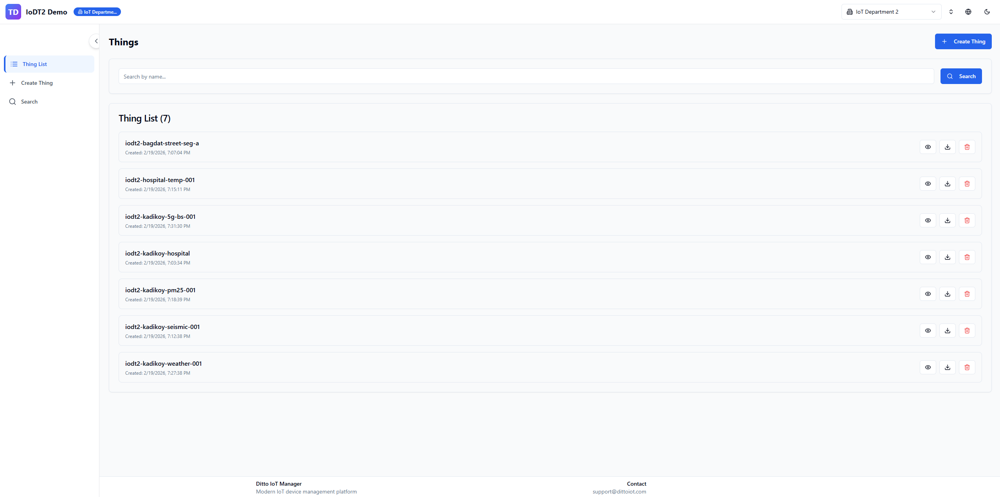

# IoDT2 Thing Description - UI Guide

A guide for creating, managing, and searching Things through the web interface.

**Access the application at:** http://localhost:3005

---

## 1. Creating a Thing

Navigate to **Things > Create New Thing** from the sidebar.

### Step 1: Basic Information

- **Select Tenant** - Choose which tenant this Thing belongs to from the dropdown.
- **Thing Name** - Enter a descriptive name (e.g., "Office Temperature Sensor 01").
- **Choose Thing Type** - Pick one of three types:
  - **Sensor** - Devices that collect data (temperature, humidity, etc.)
  - **Device** - General IoT devices
  - **Component** - Sub-components of a larger system

### Step 2: DTDL Interface Binding

Click the **Select DTDL Interface** button to open the interface browser. Interfaces are grouped by category (Environmental, Seismic, Air Quality, etc.). When you select an interface, the form auto-fills with the required properties and schema definitions from the DTDL model.

### Step 3: Define Contents

Use the tabs to configure the Thing:

- **Properties** - Add or edit properties. Each property has a name, schema type (string, integer, double, boolean, object, range), and writable flag. Properties inherited from the DTDL interface appear automatically.
- **Relationships** - Define connections to other Things by specifying a name and target interface.
- **Commands** - Add commands the Thing can execute. Supports both simple (field-based) and advanced (JSON editor) modes.
- **Location** - Pick a location on the interactive map. The system automatically resolves the address (reverse geocoding) and altitude for the selected coordinates.

### Step 4: Domain Metadata (Optional)

Expand the metadata section to specify manufacturer, model, serial number, and firmware version.

### Step 5: Review & Submit

The right panel displays a live **YAML preview** with two tabs:
- **Interface YAML** - The generated interface definition
- **Instance YAML** - The Thing instance with all configured values

Review the output and click **Create** to save.

---

## 2. Listing Things

Navigate to **Things > Thing List** from the sidebar.

The list displays all created Things as cards. Each card shows:
- Thing name and description
- Thing type badge (Sensor / Device / Component)
- Creation date

### Actions

- **Search bar** - Filter Things by name or keyword using the search input at the top.
- **Create button** - Opens the creation form for a new Thing.
- **Per-card actions:**
  - **View** - Navigate to the Thing detail page
  - **Export** - Download the Thing definition as a ZIP archive (includes YAML and metadata files)
  - **Delete** - Remove the Thing (requires confirmation)

### Empty State

If no Things have been created yet, the page displays a prompt with a direct link to the creation form.

---

## 3. Searching Things

Navigate to **Things > Search** from the sidebar.

The search page provides three modes, switchable via tabs:

### Standard Search

Free-text keyword search with optional advanced filters:
- **Domain** - Filter by domain category (environmental, seismic, air quality)
- **Type** - Filter by Thing type (sensor, device, component)
- **Status** - Filter by operational status
- **Location** - Filter by geographic area
- **Properties** - Filter by specific property existence

### Value Search

Search by property values using operators:
1. Select the **property name** from the dropdown
2. Choose an **operator** (equals, greater than, less than, contains, etc.)
3. Enter the **value** to match

Example: Find all sensors where `temperature > 25`.

### SPARQL Search

Write custom SPARQL queries directly against the Fuseki RDF store.
- Use the **Templates** button to browse and insert common query patterns
- **Copy** button copies the query to clipboard
- **Export** button downloads the query as a file

### Search Features

- **Search History** - Previous searches are saved automatically and can be re-executed with one click.
- **Saved Searches** - Click **Save Search** to bookmark a query with a custom name for quick access later.
- **Results** - Matching Things are displayed as cards with the same actions as the list view.

---

## 4. Thing Details

Click on any Thing from the list or search results to open its detail page.

The page displays information in tabs:

| Tab | Content |
|-----|---------|
| **Properties** | All defined properties with name, schema type, current value, and description |
| **Relationships** | Connected Things with relationship name and target interface |
| **Commands** | Available commands with name and description |
| **DTDL Binding** | The linked DTDL interface info and property-to-schema mapping |

### Available Actions

- **Export** - Download the complete Thing definition as a ZIP file
- **Delete** - Remove the Thing permanently
- **Back** - Return to the previous page

---

## Quick Reference

| Task | Navigation |
|------|-----------|
| Create a Thing | Sidebar > Things > Create New Thing |
| View all Things | Sidebar > Things > Thing List |
| Search Things | Sidebar > Things > Search |
| View Thing details | Thing List > Click on a card |
| API documentation | http://localhost:3015/docs |
